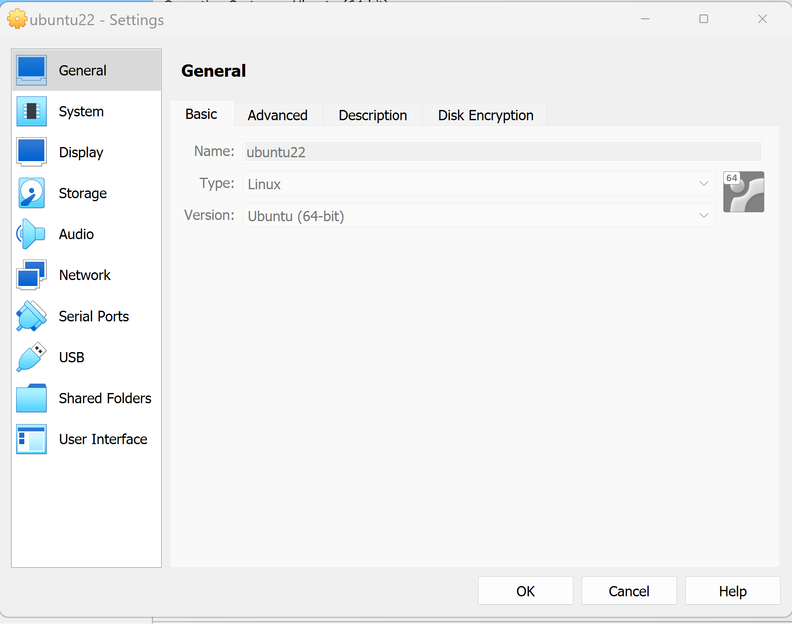
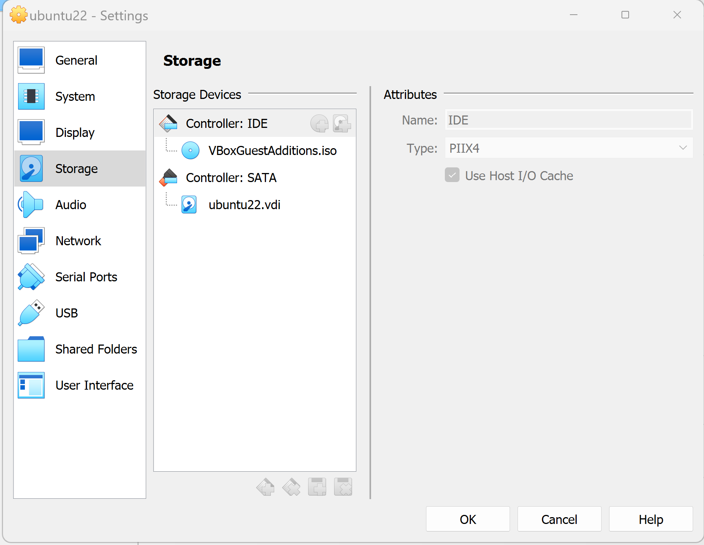
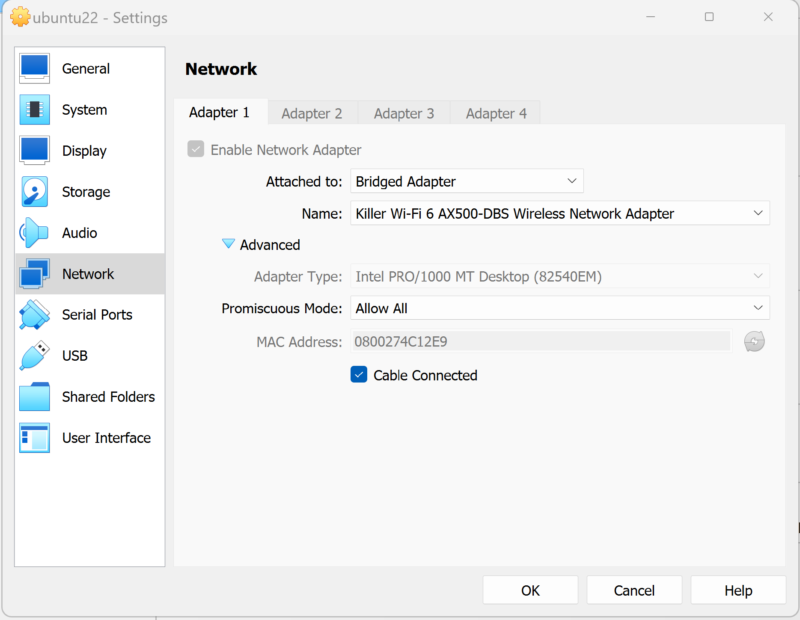
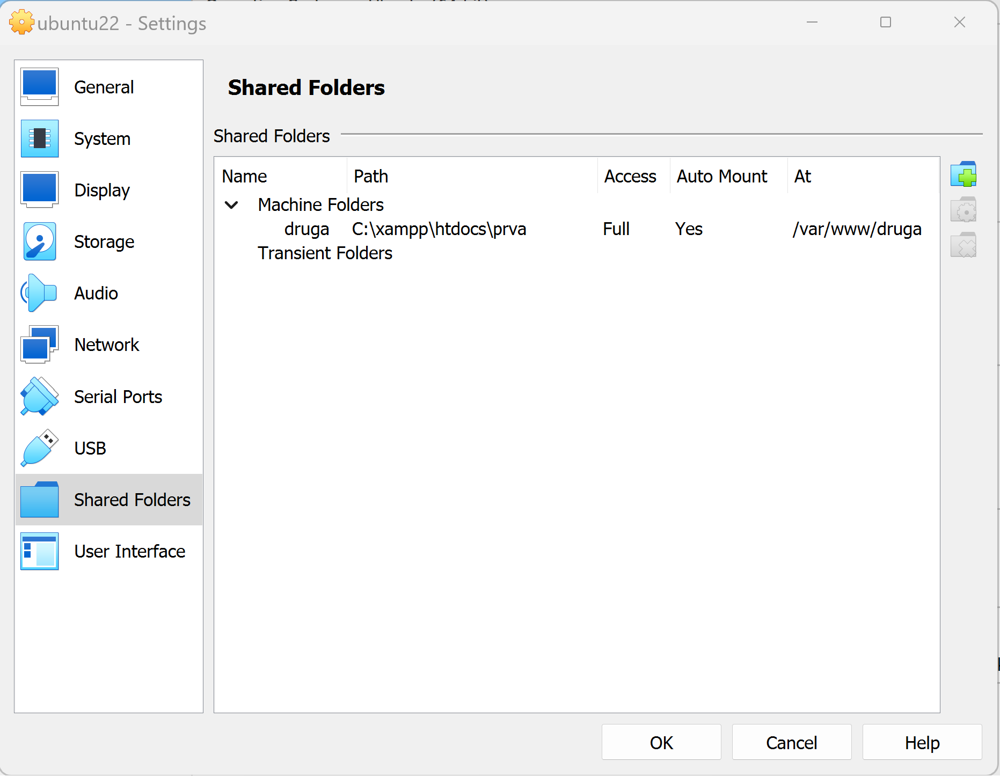
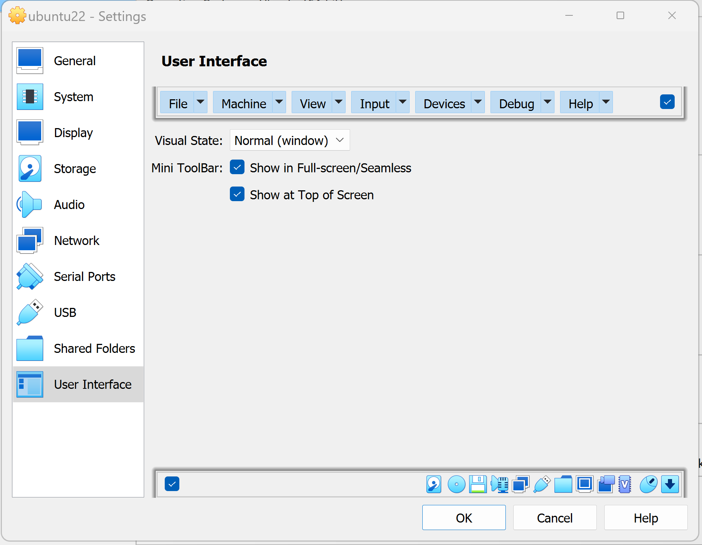
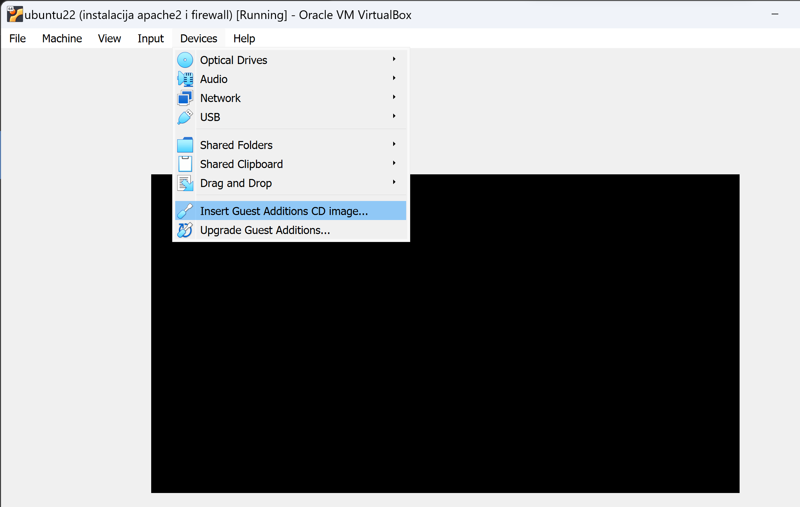

# okruzenje
Algebra radno okruznje u PHP-u

- [markdown](https://www.markdownguide.org/cheat-sheet/)
- [virtualbox](https://www.oracle.com/virtualization/technologies/vm/downloads/virtualbox-downloads.html)
- [git](https://git-scm.com/download/win)
- [VS Code](https://code.visualstudio.com/docs/setup/windows)
- [Apache on Ubuntu22](https://www.digitalocean.com/community/tutorials/how-to-install-the-apache-web-server-on-ubuntu-22-04)


## Virtualbox
- Instalirati
`  > new > type "linux", version "Ubuntu 22" > next > memory "4096", processors "2" `

### Postavke:







- IP adresa virtualnog stroja:
``` 
hostname -I
```
Vraća npr. : 192.168.199.118

- Pokrećemo stranice sa:
```
http://192.168.199.118:82/prve_stranice.php
```