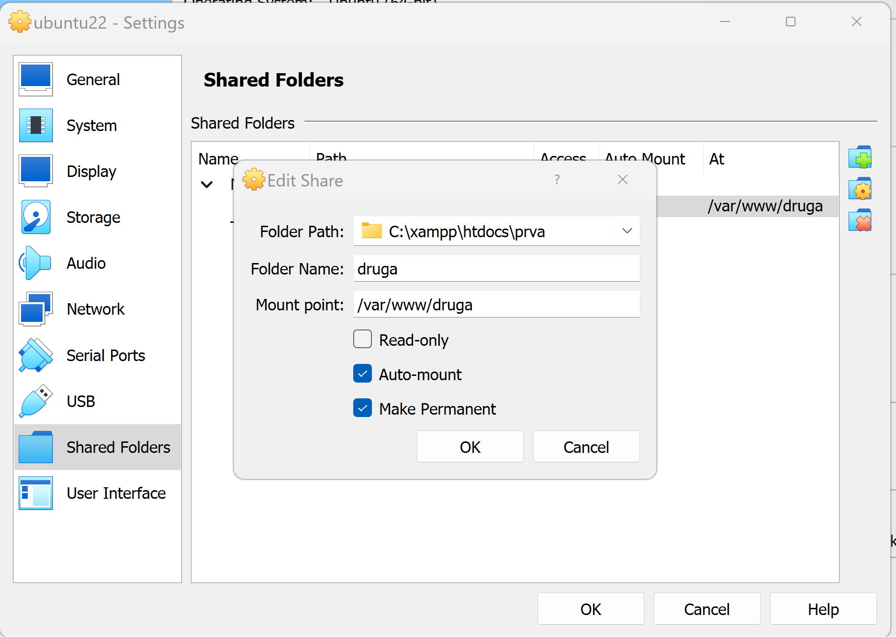

# okruzenje
Algebra radno okruznje u PHP-u

- [markdown](https://www.markdownguide.org/cheat-sheet/)
- [virtualbox](https://www.oracle.com/virtualization/technologies/vm/downloads/virtualbox-downloads.html)
- [git](https://git-scm.com/download/win)
- [VS Code](https://code.visualstudio.com/docs/setup/windows)
- [Apache on Ubuntu22](https://www.digitalocean.com/community/tutorials/how-to-install-the-apache-web-server-on-ubuntu-22-04)
- [Install php8.1 on Ubuntu22](https://www.digitalocean.com/community/tutorials/how-to-install-php-8-1-and-set-up-a-local-development-environment-on-ubuntu-22-04)


## Virtualbox
- Instalirati
`  > new > type "linux", version "Ubuntu 22" > next > memory "4096", processors "2" `

### Postavke:


- IP adresa virtualnog stroja:
``` 
hostname -I
```
Vraća npr. : 192.168.199.118

- Pokrećemo stranice sa:
```
http://192.168.199.118:82/prve_stranice.php
```

Namjestiti port u /etc/apache2/ports.conf
```
Listen 82
```

Kreirati novi virtual host u: /etc/apache2/sites-available
```
sudo touch druga.conf
```

algebra@ubuntu22:/etc/apache2/sites-available$` cat druga.conf`
```
<VirtualHost *:82>
    ServerAdmin webmaster@localhost
    ServerName druga
    ServerAlias www.druga
    DocumentRoot /var/www/druga
    ErrorLog ${APACHE_LOG_DIR}/error.log
    CustomLog ${APACHE_LOG_DIR}/access.log combined
</VirtualHost>
```
**omogućiti virtualhost "druga"**

algebra@ubuntu22:/etc/apache2/sites-available$ `sudo a2ensite druga.conf`

**učitiati novu konfiguraciju:**

algebra@ubuntu22:/etc/apache2/sites-available$ `systemctl reload apache2`

**restartirati apache (ukoliko je potrebno)**

algebra@ubuntu22:/etc/apache2/sites-available$ `systemctl restart apache2`

**Izgled sheranog foldera "druga"**
```
algebra@ubuntu22:/var/www/druga$ ls -la

total 10
drwxrwx--- 1 root vboxsf 4096 Dec  5 11:16 .
drwxr-xr-x 5 root root   4096 Dec  4 23:20 ..
-rwxrwx--- 1 root vboxsf   17 Dec  4 20:03 phpinfo.php
-rwxrwx--- 1 root vboxsf    7 Dec  4 21:16 prve_stranice.php
drwxrwx--- 1 root vboxsf    0 Dec  4 22:42 t2
drwxrwx--- 1 root vboxsf    0 Dec  4 23:29 t3
drwxrwx--- 1 root vboxsf    0 Dec  5 10:42 t4
algebra@ubuntu22:/var/www/druga$ 
```
---

#sheranje direktorija u vboxu
- 


**Instalirati guest aditions kao sudo**
```
algebra@ubuntu22:/media/algebra/VBox_GAs_7.0.12$ pwd
/media/algebra/VBox_GAs_7.0.12

algebra@ubuntu22:/media/algebra/VBox_GAs_7.0.12$ sudo ./autorun.sh
```

**Postaviti korisnika algebra i www-data u grupu vboxsf**

```
algebra@ubuntu22:/var/www/druga$ sudo adduser www-data vboxsf
algebra@ubuntu22:/var/www/druga$ sudo usermod -a -G vboxsf www-data 
algebra@ubuntu22:/var/www/druga$ sudo adduser $USER vboxsf

algebra@ubuntu22:/var/www/druga$ cat /etc/group | grep vboxsf
vboxsf:x:999:algebra,www-data
```


